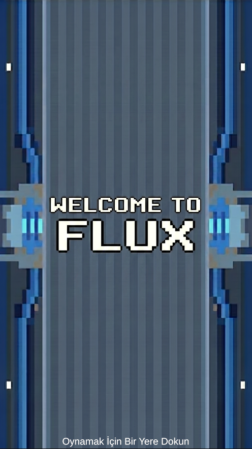
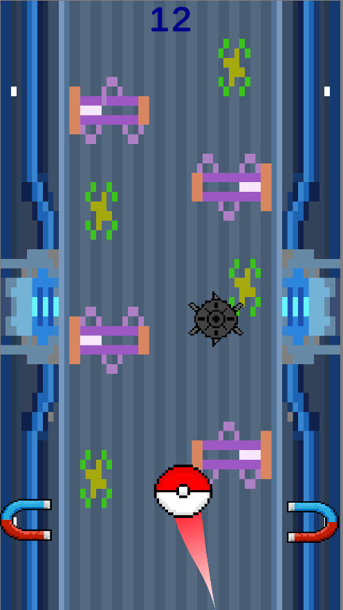
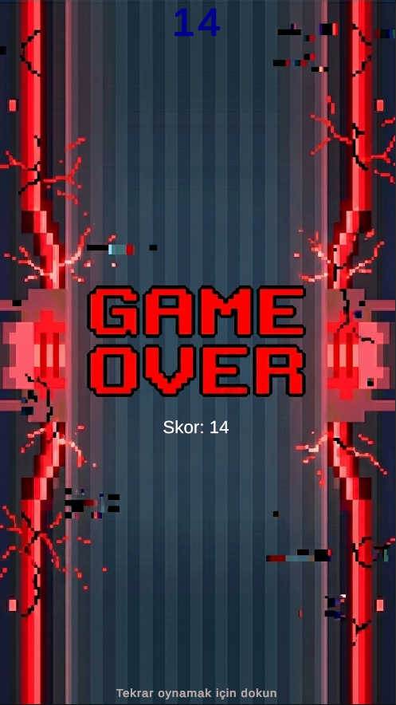

## 📸 Ekran Görüntüleri

<p align="center">
  
  &nbsp;&nbsp;&nbsp;
  
  &nbsp;&nbsp;&nbsp;
  
</p>

<p align="center">
  <sub>Karşılama Ekranı &nbsp;•&nbsp; Oynanış &nbsp;•&nbsp; Game Over</sub>
</p>

---

<h1 align="center">⚡ Flux</h1>

<p align="center">
  <b>Mıknatıs mekanikli, dikey kaydırmalı (vertical scroller) bir 2D mobil arcade oyunu.</b><br/>
  İki mıknatıs arasında sıçrayarak engelleri aş, mümkün olduğunca yükseğe çık!
</p>

<p align="center">
  
  
  
  
</p>

---


## 📖 Oyun Hakkında

**Flux**, oyuncunun ekranın sağ ve sol tarafına dokunarak bir topu iki mıknatıs arasında yönlendirdiği, sürekli yukarı kayan bir arcade oyunudur. Yolda rastgele çıkan engellere çarpmadan mümkün olduğunca yükseğe çıkmak amaçlanır.

Oyun hem **mobil (dokunmatik)** hem de **PC (fare)** kontrollerini destekler.

---

## 🎮 Oynanış Mekanikleri

### 🧲 Mıknatıs Sistemi
- Ekranın **sol yarısına** dokunulduğunda top **sol mıknatısa**, **sağ yarısına** dokunulduğunda **sağ mıknatısa** çekilir.
- Hiçbir yere basılmadığında top **en yakın mıknatısa** doğru sürüklenir.
- Top bir mıknatısa yapıştığında kısa süre tutunur, ardından otomatik olarak karşı tarafa fırlatılır.
- Dokunma anında aktif mıknatıs **titreşim efekti** verir ve **ses efekti** çalar.

### 🚧 Engel Sistemi
- Engeller belirli aralıklarla (`1.5 saniye`) oyuncunun üst kısmında **rastgele X pozisyonlarında** oluşturulur.
- Kameranın gerisinde kalan engeller otomatik olarak yok edilir (bellek optimizasyonu).
- Engele çarpmak oyunu **yeniden başlatır**.

### 📊 Skor Sistemi
- Skor, topun **başlangıç noktasından ne kadar yükseldiğine** göre hesaplanır.
- Skor yalnızca **yukarı** giderken artar, top geri düşse bile skor azalmaz (en yüksek değer korunur).
- Anlık skor ekranda **TextMesh Pro** ile gösterilir.

### 🎬 Başlangıç Akışı
1. Oyun **LoginScene** ile açılır ("Tap to Start" ekranı).
2. Ekrana dokunulduğunda **ana oyun sahnesine** (SampleScene) geçilir.
3. Oyun sahnesinde ilk dokunuşa kadar top hareketsiz bekler.
4. İlk dokunuşla birlikte top yukarı doğru hareket etmeye başlar.

---

## 🏗️ Proje Yapısı

```
Flux/
├── Assets/
│   ├── MyAssets/               # Oyun görselleri ve animasyonları
│   │   ├── FluxBg.png          # Arka plan sprite'ı
│   │   ├── LeftMagnet.png      # Sol mıknatıs görseli
│   │   ├── RightMagnet.png     # Sağ mıknatıs görseli
│   │   ├── Pokeball.png        # Oyuncu (top) görseli
│   │   ├── New Piskel.png      # Engel sprite sheet
│   │   ├── Obstacle.anim       # Engel animasyonu
│   │   └── ObstacleAnimation.prefab  # Engel prefab'ı
│   │
│   ├── Scripts/                # Oyun scriptleri (C#)
│   │   ├── MagnetController.cs # Ana oyun mekaniği - mıknatıs çekme/fırlatma
│   │   ├── CameraFollow.cs     # Kameranın topu Y ekseninde takibi
│   │   ├── PlayerCollision.cs  # Engel çarpışma ve oyun sonu yönetimi
│   │   ├── ObstacleSpawner.cs  # Engel oluşturma sistemi
│   │   ├── ObstacleCleanup.cs  # Geride kalan engellerin temizlenmesi
│   │   ├── ScoreManager.cs     # Puan hesaplama ve UI güncelleme
│   │   ├── PulsingText.cs      # UI metin animasyonu (büyüme + fade efekti)
│   │   └── TapToStart.cs       # Başlangıç ekranı - sahne geçişi
│   │
│   ├── Scenes/                 # Unity sahneleri
│   │   ├── LoginScene.unity    # Giriş/başlangıç ekranı
│   │   └── SampleScene.unity   # Ana oyun sahnesi
│   │
│   ├── Settings/               # URP render ayarları
│   └── TextMesh Pro/           # TMP kütüphanesi
│
├── Packages/                   # Unity paket bağımlılıkları
├── ProjectSettings/            # Unity proje konfigürasyonu
└── .gitignore                  # Git izleme dışı bırakma kuralları
```

---

## 📜 Script Detayları

| Script | Sorumluluk | Temel Özellikler |
|--------|-----------|------------------|
| **MagnetController** | Oyunun ana mekaniği | Dokunma yönüne göre mıknatıs çekimi, yapışma-fırlatma döngüsü, titreşim efekti |
| **CameraFollow** | Kamera takibi | Topun Y pozisyonunu offset ile takip eder, X/Z sabit kalır |
| **PlayerCollision** | Çarpışma algılama | "Obstacle" etiketli objelere çarpınca sahneyi yeniden yükler |
| **ObstacleSpawner** | Engel üretimi | Belirli aralıklarla rastgele X konumunda engel oluşturur |
| **ObstacleCleanup** | Bellek yönetimi | Kameranın altında kalan engelleri otomatik yok eder |
| **ScoreManager** | Skor sistemi | Yüksekliğe dayalı skor hesaplar, en yüksek değeri korur |
| **PulsingText** | UI animasyonu | Sinüs dalgasıyla büyüme/küçülme ve fade efekti uygular |
| **TapToStart** | Sahne geçişi | Dokunma ile LoginScene → SampleScene geçişi yapar |

---

## ⚙️ Teknik Detaylar

- **Unity Sürümü:** `6000.3.14f1` (Unity 6)
- **Render Pipeline:** Universal Render Pipeline (URP) — 2D Renderer
- **Fizik:** Rigidbody2D tabanlı kuvvet sistemi
- **UI:** TextMesh Pro (TMP)
- **Input:** Hem `Input.GetMouseButton` (PC) hem `Input.GetTouch` (Mobil) desteği
- **Sahne Yönetimi:** `SceneManager.LoadScene` ile sahne geçişleri

---

## 🚀 Kurulum & Çalıştırma

### Gereksinimler
- **Unity 6000.3.14f1** veya üzeri
- **Universal Render Pipeline** paketi (projede dahil)

### Adımlar

1. **Repoyu klonlayın:**
   ```bash
   git clone https://github.com/kaanekoc/Flux.git
   ```

2. **Unity Hub'da açın:**
   - Unity Hub → **Open** → Klonlanan klasörü seçin
   - Doğru Unity sürümünü yükleyin (istenirse)

3. **Oyunu çalıştırın:**
   - `Assets/Scenes/LoginScene` sahnesini açın
   - **Play** butonuna basın
   - Ekrana tıklayarak oyunu başlatın

---

## 🎯 Oyun Kontrolleri

| Platform | Kontrol | Açıklama |
|----------|---------|----------|
| **PC** | Sol tık (ekranın sol yarısı) | Topu sol mıknatısa çek |
| **PC** | Sol tık (ekranın sağ yarısı) | Topu sağ mıknatısa çek |
| **Mobil** | Dokunma (sol yarı) | Topu sol mıknatısa çek |
| **Mobil** | Dokunma (sağ yarı) | Topu sağ mıknatısa çek |

---

## 🔧 Ayarlanabilir Parametreler (Inspector)

Tüm parametreler Unity Inspector panelinden kolayca düzenlenebilir:

### MagnetController
| Parametre | Varsayılan | Açıklama |
|-----------|-----------|----------|
| `pullForce` | 15 | Mıknatısın çekim kuvveti |
| `upSpeed` | 5 | Topun yukarı doğru sabit hızı |
| `stickTime` | 2s | Mıknatısa yapışma süresi |
| `throwForce` | 15 | Fırlatma kuvveti |
| `shakeIntensity` | 0.08 | Mıknatıs titreşim şiddeti |

### ObstacleSpawner
| Parametre | Varsayılan | Açıklama |
|-----------|-----------|----------|
| `spawnInterval` | 1.5s | Engel oluşturma aralığı |
| `spawnWidth` | 2.2 | X ekseninde engel yayılma alanı |

---

## 📄 Lisans

Bu proje kişisel/eğitim amaçlı geliştirilmiştir.

---

<p align="center">
  <b>⚡ Flux — İki mıknatıs, bir top, sonsuz eğlence.</b>
</p>
